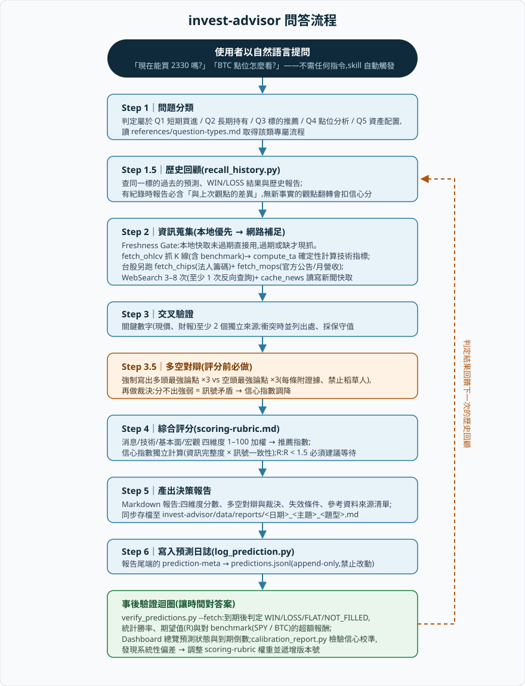

# 📈 stock-agent — 股票與加密貨幣投資決策 Agent

以 Claude Code Skill 打造的投資決策顧問:對任何投資問題執行**多源資訊蒐集 →
交叉驗證 → 多空對辯 → 量化評分(1–100)**,產出 Markdown 決策報告,並把每一次
判斷寫入 append-only 預測日誌——到期後用實際價格路徑判定 WIN/LOSS,讓統計數據
檢驗這套系統是否誠實。

> ⚠️ 所有輸出皆為 AI 綜合公開資訊之分析,**非投資建議**;不做自動下單,
> 最終決策與風險由使用者承擔。

```
stock-agent/
├── invest-advisor/     # Claude Code Skill 本體(流程、腳本、資料層、測試)
├── dashboard/          # Web Dashboard(FastAPI 後端 + Next.js 前端)
├── backup/             # 歷史報告備份
└── docs/               # 文件資產(流程圖等)
```

---

## 1. Skill 架構

skill 位於 `invest-advisor/`,採 **Progressive Disclosure** 設計:`SKILL.md` 只放
觸發條件與主流程,細則拆進 `references/` 由 Claude 按需載入,避免一次塞爆 context。

```
invest-advisor/
├── SKILL.md                    # 觸發條件 + 主流程 Step 1–6(skill 本體)
├── README.md                   # skill 詳細說明文件
├── references/                 # 細則(按需載入)
│   ├── question-types.md       #   Q1–Q5 五類問題的個別流程
│   ├── scoring-rubric.md       #   評分錨點、維度權重、信心規則(附版本號)
│   ├── ta-checklist.md         #   compute_ta 輸出判讀、多時框合成
│   ├── crypto-specific.md      #   加密貨幣專屬:鏈上、資金費率、BTC 主導率
│   ├── report-templates.md     #   各題型輸出模板 + prediction-meta 規格
│   └── data-sources.md         #   資料來源優先序、TTL、降級路徑
├── scripts/                    # 零第三方依賴的 Python 腳本(Python 3.10+)
│   ├── fetch_ohlcv.py          #   抓歷史 K 線(Yahoo / Binance,增量入庫)
│   ├── compute_ta.py           #   確定性計算技術指標(禁止 LLM 目測心算)
│   ├── fetch_chips.py          #   台股三大法人買賣超 + 融資券(TWSE/TPEx)
│   ├── fetch_mops.py           #   MOPS 重大訊息 + 月營收(官方一手資料)
│   ├── cache_news.py           #   新聞情緒摘要快取(24h TTL)
│   ├── recall_history.py       #   查同標的歷史預測與判定結果
│   ├── log_prediction.py       #   寫入預測日誌(含格式斷言)
│   ├── verify_predictions.py   #   到期判定 WIN/LOSS + 績效統計
│   ├── calibration_report.py   #   信心校準 + Brier Score 報告
│   ├── dashboard.py            #   靜態 HTML 總覽(零依賴備援版)
│   └── cache_gc.py             #   清理過期快取
├── data/                       # 資料層(skill 是唯一寫入者)
│   ├── market.db               #   SQLite:OHLCV / 籌碼 / 基本面
│   ├── news_cache.db           #   新聞摘要快取
│   ├── predictions.jsonl       #   預測日誌(append-only,禁止事後修改)
│   ├── outcomes.jsonl          #   判定結果(衍生檔,每次驗證重建)
│   └── reports/                #   唯一報告目錄:<日期>_<主題>_<題型>.md
├── assets/report-template.md   # 報告外框骨架
├── evals/eval-cases.md         # 10 個評測案例 + 3 個反事實測試
└── tests/                      # pytest 測試套件(78 個單元測試)
```

三個核心設計原則:

1. **技術指標零幻覺**——LLM 不目測 K 線、不心算 RSI。K 線存本地 SQLite,指標由
   `compute_ta.py` 純 Python 確定性計算,LLM 只讀一行 JSON 結果。
2. **Freshness Gate 防過時**——每類資料有明確 TTL;即時價格與盤中新聞永遠現抓、
   永不快取。帶著過時資料的檢索會產生「有憑有據的錯誤」。
3. **每個判斷可證偽**——報告強制附失效條件,每筆預測進 append-only 日誌,
   到期後由實際價格判定,系統好壞由統計說話。

## 2. 使用方式

### 安裝

skill 需位於 `~/.claude/skills/invest-advisor`。建議用連結讓開發目錄與安裝目錄
同步(Windows 用 NTFS junction,macOS/Linux 用 symlink):

```powershell
# Windows
New-Item -ItemType Junction `
  -Path   "C:\Users\<you>\.claude\skills\invest-advisor" `
  -Target "D:\coding\stock-agent\invest-advisor"
```

```bash
# macOS / Linux
ln -s /path/to/stock-agent/invest-advisor ~/.claude/skills/invest-advisor
```

環境需求只有 **Python 3.10+,無任何第三方套件**(Web Dashboard 另需 Node.js)。

### 提問

**不需要任何指令。** 在 Claude Code 對話中直接用自然語言提問,只要問題涉及
投資決策——甚至只是提到股票代號/幣種名稱並詢問看法——skill 就會自動觸發,
跑完整個流程後給你一份決策報告。

### 事後動作(同樣用講的就好)

| 你可以這樣說 | skill 會做什麼 |
|------|------|
| 「驗證一下之前的推薦」「對個答案」 | 跑 `verify_predictions.py --fetch`,白話解讀每筆 WIN/LOSS 與整體勝率 |
| 「開 dashboard」「看預測總覽」 | 啟動 Web Dashboard 並開 http://localhost:3000(見第 6 節) |
| 「看我的預測紀錄」 | 讀 `data/predictions.jsonl` 整理成表格 |
| 「列出歷史報告」 | 列出/開啟 `data/reports/` 下的決策報告 |
| 「這套評分系統準嗎?」 | 跑 `calibration_report.py` 產出校準報告 |
| 「清一下過期快取」 | 跑 `cache_gc.py` |

進階者也可以手動執行 `invest-advisor/scripts/` 下的腳本,完整參數說明見
[`invest-advisor/README.md`](invest-advisor/README.md)。

## 3. 問答流程

每次提問都走完 Step 1 → 6,一步不省:



文字版摘要:

```
提問 → [1] 問題分類(Q1–Q5)
     → [1.5] 歷史回顧(同標的過去說過什麼?錯過什麼?)
     → [2] 資訊蒐集(本地優先 → 網路補足;台股加抓官方籌碼與公告)
     → [3] 交叉驗證(關鍵數字雙來源)
     → [3.5] 多空對辯(多頭×3 vs 空頭×3 → 裁決)
     → [4] 綜合評分(四維度加權 → 推薦指數;信心指數獨立計算)
     → [5] 產出報告(對話呈現 + 存檔 data/reports/)
     → [6] 寫入預測日誌(append-only)
     ⤷ 到期後:verify_predictions 判定 WIN/LOSS → 回饋下一次的歷史回顧
```

### 讀懂報告中的兩個分數

- **推薦指數(1–100)**:四維度加權總分。80–100 強烈看多 ｜ 60–79 偏多 ｜
  40–59 中性觀望 ｜ 20–39 偏空 ｜ 1–19 強烈看空
- **信心指數(1–100)**:獨立於方向,反映「資訊完整度 × 訊號一致性」。訊號矛盾、
  冷門標的資料稀缺、關鍵數字單一來源都會被規則強制扣分,**信心 < 40 的報告會
  明說「參考價值有限」——請當作它真的有限**。

## 4. 會搜尋的參考資料與分析方法

### 資料來源與新鮮度(Freshness Gate)

先查本地、未過期直接用;過期或缺才現抓:

| 資料 | 來源 | TTL |
|------|------|-----|
| 歷史 K 線(OHLCV) | 股票:Yahoo Finance v8(1d/1w)/ 加密貨幣:Binance 公開 REST(1d/4h/1w),存 `market.db` | 永久,增量更新 |
| 技術指標 | **只能**由 `compute_ta.py` 確定性計算(SMA/RSI/MACD/ATR/支撐壓力…) | 隨 K 線 |
| 現價、盤中新聞 | 永遠 WebSearch 現抓,標註查詢時間戳 | 不快取 |
| 新聞情緒摘要 | `news_cache.db`(`cache_news.py` 讀寫) | 24 小時 |
| 台股籌碼(三大法人/融資券) | TWSE / TPEx 官方端點(`fetch_chips.py`) | 永久,增量累積 |
| 官方公告、月營收 | MOPS 公開資訊觀測站(`fetch_mops.py`) | 不快取 |
| 基本面(財報等) | fundamentals 表,過期現抓 | 至下次財報日 |

全部來源**免 API key**。

### 分析怎麼做

1. **來源分層**:A 級(官方一手:MOPS、TWSE 籌碼、財報)> B 級(主流財經媒體)
   > C 級(自媒體/論壇,**只能當情緒溫度計,不得作為評分論據**)。
   消息面論據至少一半須來自 A/B 級;A 級與新聞敘事矛盾時以 A 級為準。
2. **強制反向查詢**:每標的 3–8 次搜尋中至少 1 次必須找反面證據
   (「{標的} 利空」「short thesis」),避免被單邊敘事主導;權值股另做
   至少 1 次英文外媒對照(Reuters/Bloomberg 視角)。
3. **交叉驗證**:現價、財報等關鍵數字至少 2 個獨立來源;本地快取只算一個來源;
   衝突時並列兩個數字與出處,採保守值計算交易計畫並扣信心分。
4. **多空對辯後才評分**:先強制寫出「聰明的多頭會說什麼 ×3」與「聰明的空頭
   會說什麼 ×3」(每條附證據、禁止立稻草人),裁決哪方證據更強,結論必須與
   評分方向一致。
5. **四維度加權評分**:消息面/技術面/基本面/宏觀,各 1–100 依 rubric 錨點給分,
   權重依資產類別與題型不同(如股票技術面 30%、Q3 短期推薦技術面 45%)。
6. **信心指數誠實扣分**:起算 70 分,訊號嚴重矛盾 −15、關鍵數字單一來源 −10、
   冷門標的資料稀缺 −10……上限 90(永遠保留不確定性)。
7. **交易計畫錨定數據**:進場/止損/止盈必須錨定 compute_ta 的支撐壓力與 ATR,
   不得憑空給整數關卡;**風險報酬比 R:R < 1.5 一律建議放棄或等待**。

細則全文:[`references/data-sources.md`](invest-advisor/references/data-sources.md)、
[`references/scoring-rubric.md`](invest-advisor/references/scoring-rubric.md)。

## 5. 問題類型與提問範例

skill 把投資問題分成五類,各有專屬流程與輸出格式——直接照範例的口吻問即可:

| 類型 | 你可以這樣問 | 你會得到什麼 |
|------|---------|-------------|
| **Q1 短期買進判斷** | 「現在能買 TSLA 嗎?」<br>「2330 可以進場嗎?」<br>「ETH 現在適合做多嗎?」 | 四維度分析 + **交易計畫表**(進場區間/止損/止盈 1、2/R:R)。R:R < 1.5 會直接建議等待,並告訴你等到什麼條件才值得進 |
| **Q2 長期持有判斷** | 「NVDA 適合長抱三年嗎?」<br>「0050 值得存嗎?」 | 6 個月與 12 個月的多頭論點、依賴的關鍵假設、合理估值區間,以及**失效條件**(什麼事件發生就該離場) |
| **Q3 標的推薦** | 「最近有什麼短期值得投資的美股?」<br>「推薦幾檔長期看好的台股」 | 篩選漏斗(初選 8–12 檔 → 淘汰至 3–5 檔 → 完整評分)後的排序表,每檔含進場參考位與**主要風險**(強制欄位,不會只給多頭理由) |
| **Q4 點位分析** | 「BTC 現在的點位怎麼看?」<br>「AAPL 支撐壓力在哪?」 | 多時框技術分析(週線定方向 → 日線定結構 → 加密貨幣加 4H)+ **情境樹**:突破/回踩/跌破三條路徑,各含觸發價位與對應行動 |
| **Q5 資產配置** | 「我 60% TSLA、30% BTC、10% 現金,怎麼調?」 | 先確認風險承受度、投資期限、流動性需求(缺了會先問),再給曝險分析(單一標的 >25% 標紅)與**調整前 vs 調整後對比表**,每個動作附理由 |

補充規則:

- 問題橫跨多類(「能買嗎?順便看點位」)→ 以主要意圖為準,次要需求併入報告章節。
- 提到**配息/殖利率/存股** → 報告自動附配息數據區塊(近 4 次配息、回顧/前瞻
  殖利率、下次除息日)。
- **比較兩檔以上**(「0050 還是 00918?」)→ 自動附同一基準日的比較表格。
- 沒給標的(Q3 除外)→ skill 會先問清楚,不亂猜。
- 同標的 1 小時內重複問 → 沿用剛才的結論(方向不反轉),除非有新的重大消息。

## 6. Dashboard 怎麼使用

### Web 版(推薦):FastAPI + Next.js

前後端分離的預測總覽網頁。skill 仍是唯一的資料寫入者,dashboard 對
`predictions.jsonl` 只讀不寫。

**啟動方式一(Windows 一鍵)**:

```powershell
cd stock-agent\dashboard
.\start.ps1     # 開兩個視窗(uvicorn :8787 / next dev :3000)+ 自動開瀏覽器
```

**啟動方式二(跨平台手動)**:

```bash
cd dashboard/backend  && python -m uvicorn main:app --reload --port 8787
cd dashboard/frontend && npm run dev        # http://localhost:3000
```

也可以直接在 Claude Code 對話中說「**開 dashboard**」,skill 會代你啟動並開瀏覽器。

**頁面功能**(側邊導覽:總覽 / 市場預測 / 決策日曆):

1. **頂部狀態卡**——「待驗證」與「開倉中」筆數一眼掃過;有預測到期未驗證時
   會出現黃色提醒橫幅。
2. **「更新驗證」按鈕**——一鍵呼叫後端執行 `verify_predictions.py --fetch`
   (先自動更新 K 線再判定 WIN/LOSS),完成後自動刷新全部資料,並可展開
   查看驗證日誌。
3. **總覽統計卡**——勝率、期望值(R)、方向準確率、平均超額報酬
   (樣本不足時附警語)。
4. **市場預測總表**——每筆預測的標的、方向、推薦/信心分數、進場區/SL/TP、
   R:R、狀態彩色標籤、到期倒數,台股與加密貨幣訊號分開檢視。
5. **決策報告日曆**——`data/reports/` 下所有歷史報告,點開即以 Markdown
   渲染回看。

**後端 API**(Swagger:http://localhost:8787/docs):

| Method | Path | 說明 |
|--------|------|------|
| GET | `/api/health` | 健康檢查 + 資料目錄位置 |
| GET | `/api/predictions` | 預測日誌(已 join 判定結果、到期倒數) |
| GET | `/api/stats` | 勝率 / 期望值(R)/ 方向準確率 / 超額報酬 |
| GET | `/api/reports`、`/api/reports/{name}` | 報告清單 / 單份報告內容 |
| GET | `/api/calibration` | 信心校準表 + Brier + regime 分層 |
| POST | `/api/verify?fetch=true` | 執行驗證並回傳統計摘要 |

### 靜態 HTML 備援(零依賴,不需 Node)

```bash
cd invest-advisor/scripts
python dashboard.py          # 產出 data/dashboard.html,瀏覽器直接開
python dashboard.py --text   # 不開瀏覽器,終端印精簡表格
```

內容與 Web 版等價:預測總表(狀態/到期倒數/報酬率)、到期提醒橫幅、
歷史報告清單。

### 建議的每週例行流程

```bash
python scripts/verify_predictions.py --fetch   # 更新 K 線 + 判定到期預測
# 然後開 dashboard 查看最新勝率與待驗證清單
```

---

## 開發與測試

```bash
cd invest-advisor && python -m pytest tests -q   # 78 個單元測試
cd dashboard/backend && python -m pytest test_api.py -q
```

更多細節見 [`invest-advisor/README.md`](invest-advisor/README.md)(skill 詳細
說明)與 [`dashboard/README.md`](dashboard/README.md)(dashboard 擴充指引)。
